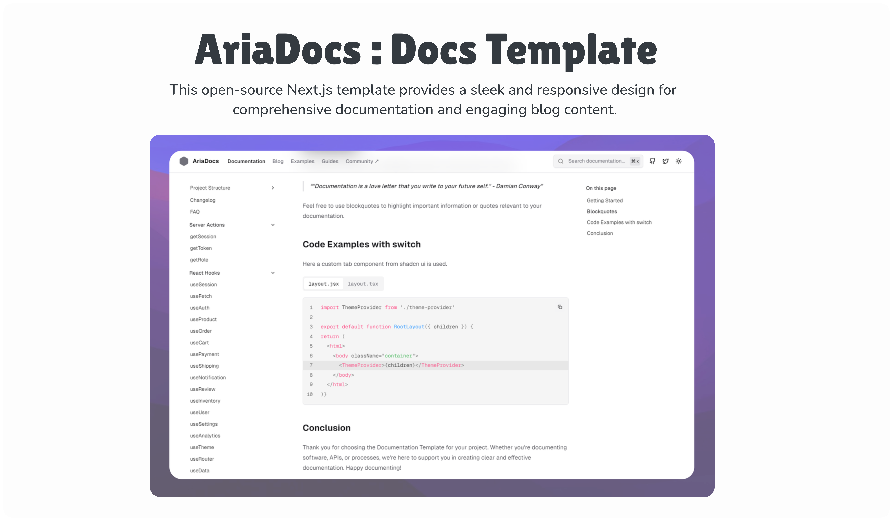

# 📈 vnstock-js Documentation

Official documentation site for [vnstock-js](https://www.npmjs.com/package/vnstock-js) - A lightweight NPM package for fetching Vietnam stock market data from VCI.



## 🚀 Live Site

Visit the live documentation at: **[vnstock-js-docs.vercel.app](https://vnstock-js-docs.vercel.app/)**

## 📖 About vnstock-js

**vnstock-js** is a lightweight NPM package that provides easy access to Vietnam stock market data through VCI's API. It's designed for JavaScript/TypeScript developers who want to integrate Vietnamese stock market data into their applications.

### Key Features

- **Stock Market Data**: Real-time and historical stock prices
- **Commodity Data**: Gold prices from SJC and other commodities
- **Trading Information**: Market trading data and statistics
- **Financial Data**: Company financial information
- **Listing Data**: Stock listing and market information
- **TypeScript Support**: Full TypeScript definitions included

## 🛠️ Quick Start

### Installation

```bash
npm install vnstock-js@latest
```

### Basic Usage

```typescript
import { stock, commodity } from 'vnstock-js';

// Get stock prices
const prices = await stock.price('VCI', '2025-01-01');

// Get gold prices from SJC
const goldPrices = await commodity.gold.priceSJC();
```

### Advanced Usage

```typescript
import vnstock from 'vnstock-js';

// Access comprehensive data
const prices = await vnstock.stock.quote.history({
  symbols: ['VCI'],
  start: '2025-01-01',
  timeFrame: '1D'
});
```

## 🏗️ Development

This documentation site is built with:

- **Next.js 15** - React framework
- **TypeScript** - Type safety
- **Tailwind CSS** - Styling
- **MDX** - Content authoring
- **AriaDocs Template** - Documentation framework

### Getting Started

1. **Clone the repository**
   ```bash
   git clone <repository-url>
   cd vnstock-js-docs
   ```

2. **Install dependencies**
   ```bash
   pnpm install
   ```

3. **Start development server**
   ```bash
   pnpm dev
   ```

4. **Open your browser**
   Navigate to [http://localhost:3000](http://localhost:3000)

### Build for Production

```bash
pnpm build
pnpm start
```

## 📁 Project Structure

```
vnstock-js-docs/
├── app/                    # Next.js app directory
├── components/             # React components
├── contents/              # Documentation content (MDX)
│   ├── docs/             # API documentation
│   └── blogs/            # Blog posts
├── lib/                   # Utility functions
└── public/               # Static assets
```

## 🤝 Contributing

We welcome contributions to improve the documentation! Here's how you can help:

1. **Report Issues**: Found a typo or incorrect information? Open an issue
2. **Suggest Improvements**: Have ideas for better documentation? Let us know
3. **Submit PRs**: Want to fix something directly? Submit a pull request

## 📚 Documentation Sections

- **Getting Started**: Installation and quick start guides
- **API References**: Complete API documentation
- **Key Features**: Detailed feature explanations
- **Examples**: Code examples and use cases
- **Blog**: Updates and announcements

## 🔗 Related Links

- **NPM Package**: [vnstock-js](https://www.npmjs.com/package/vnstock-js)
- **GitHub Repository**: [ttqteo/vnstock-js](https://github.com/ttqteo/vnstock-js)
- **Inspired by**: [thinh-vu/vnstock](https://github.com/thinh-vu/vnstock)

## 📄 License

This documentation site is licensed under the [Apache 2.0 License](LICENSE).

---

**Made with ❤️ by [ttqteo](https://github.com/ttqteo)**

For questions or support, contact: [ttqwork@gmail.com](mailto:ttqwork@gmail.com)